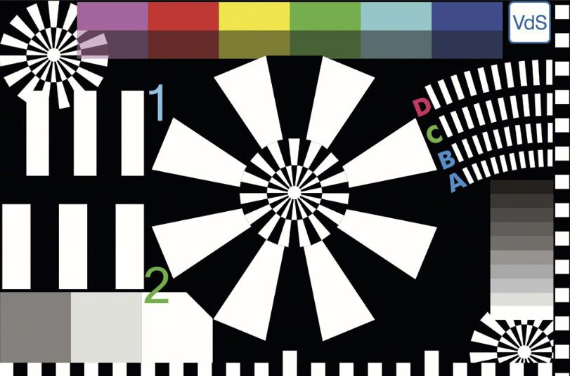
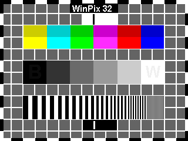
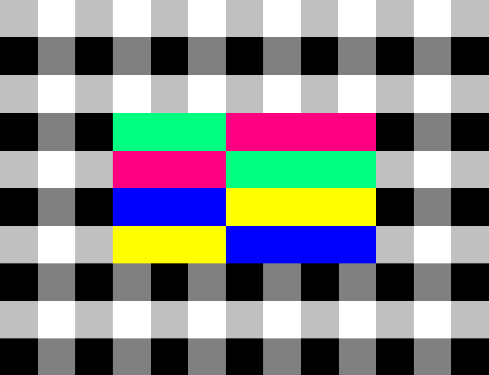

######
Images
######

Figures are images with captions.

In PDFs, figures are automatically repositioned by LaTeX to optimise the use of page space. Therefore, they will not necessarily appear near any related text. It is sensible to use a reference to the relevant figure, or use an image instead, which will not 'float'.

.. note::

   The default prefix for figures is:

   .. code-block:: none

      Fig.

   This has been changed to:

   .. code-block:: none

      Figure

   (the word *Figure* followed by a space).

*******
Figures
*******

   Unscaled figure (``jpg``)

   Scaled Figure (25%)

This text comes *before* :ref:`right-aligned-scaled-figure`.

.. _right-aligned-scaled-figure:

   Right-aligned Scaled (25%) Figure (320x240px)

This text comes *after* :ref:`right-aligned-scaled-figure`.

   Caption with formats: **BOLD**, *ITALICS*, ``CODE``

.. figure:: BBCHD_testcard_big.jpg

   Unscaled Figure

.. figure:: BBCHD_testcard_big.jpg
   :align: left
   :scale: 25%

   Left-aligned Scaled (25%) Figure (``scale=25%``)

.. figure:: BBCHD_testcard_big.jpg
   :align: right
   :scale: 35%

   Right-aligned Scaled (35%) Figure (``scale=35%``)

******
Images
******

Next is an unscaled image:

.. image:: BBCHD_testcard_big.jpg

That was an unscaled image.

There now follows a scaled (25%) image:

That was a scaled image.

Next is a Right-Aligned Scaled Image

That was a Right-Aligned Scaled (25%) Image.

***********************
Images for ``graphviz``
***********************

These images are included only to test embedded images
in ``graphviz``.

